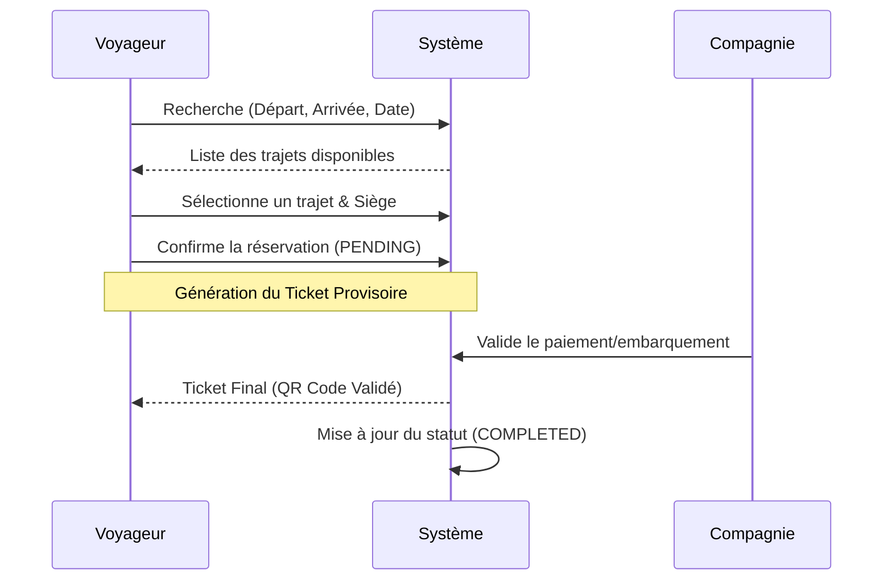
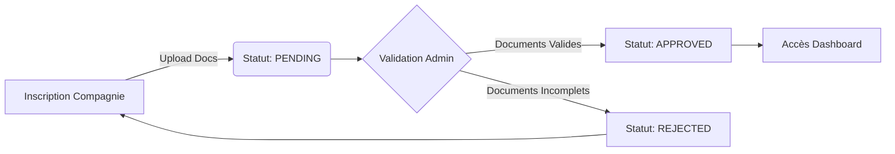

# 🚌 VoyageBj - Plateforme de Réservation de Transport au Bénin

<div align="center">


[](https://github.com/voyagebj)
[](https://reactjs.org/)
[](https://www.typescriptlang.org/)
[](https://tailwindcss.com/)
[](LICENSE)

**La première plateforme digitale qui révolutionne le transport interurbain au Bénin.**
Connectez-vous, réservez, voyagez.

[Fonctionnalités](#-fonctionnalités) • [Architecture](#-architecture) • [Workflows](#-workflows) • [Documentation](#-documentation)

</div>

---

## 📋 Table des Matières

- [🎯 Vue d'ensemble](#-vue-densemble)
- [✨ Fonctionnalités Clés](#-fonctionnalités-clés)
- [🛠 Stack Technique](#-stack-technique)
- [🏗 Architecture du Projet](#-architecture-du-projet)
- [🔄 Workflows Métier](#-workflows-métier)
- [🚀 Installation & Démarrage](#-installation--démarrage)
- [📚 Documentation](#-documentation)
- [🤝 Contribution](#-contribution)

---

## 🎯 Vue d'ensemble

**VoyageBj** est une solution SaaS complète conçue pour moderniser le secteur du transport au Bénin. Elle offre une interface unifiée pour :
1.  **Les Voyageurs** : Réservation de billets en ligne, et suivi des trajets.
2.  **Les Compagnies** : Gestion de flotte, planification des départs, et suivi des réservations.
3.  **L'Administration** : Supervision du réseau, validation des acteurs, et statistiques globales.

### 🎨 Identité Visuelle
Le design system est ancré dans l'identité nationale :
- 🟢 **Vert (#008751)** : Espérance & Renouveau (Actions principales, Succès)
- 🟡 **Jaune (#FCD116)** : Richesse & Présage (Éléments Premium, Avertissements)
- 🔴 **Rouge (#E8112D)** : Courage & Force (Actions destructives, Erreurs)

---

## ✨ Fonctionnalités Clés

| Module | Fonctionnalités |
| :--- | :--- |
| **👤 Espace Voyageur** | • Recherche intelligente (Ville, Date, Compagnie)<br>• Sélection de siège visuelle<br>• Billets QR Code (PDF/PNG)<br>• Historique |
| **🏢 Espace Compagnie** | • Dashboard Analytique (Analytiques des réservations, Taux de remplissage)<br>• Gestion des Gares & Trajets<br>• Validation des embarquements (Scan QR)<br>• Rapports financiers exportables |
| **🛡️ Espace Admin** | • KYC Compagnies (Vérification IFU, RCCM)<br>• Supervision du trafic en temps réel<br>• Gestion des utilisateurs & Rôles<br>• Audit logs |

---

## 🛠 Stack Technique

### Frontend
- **Framework** : React 19 (Hooks, Context API)
- **Langage** : TypeScript 5.7 (Strict Mode)
- **Build Tool** : Vite 6.1 (HMR, Optimisation)
- **Styling** : Tailwind CSS 4 (JIT, Design System)

### Bibliothèques Principales
| Lib | Usage |
| :--- | :--- |
| `lucide-react` | Icônes vectorielles légères |
| `recharts` | Visualisation de données (Graphiques) |
| `react-router-dom` | Routage client-side (SPA) |
| `jspdf` / `html2canvas` | Génération de documents PDF |
| `framer-motion` | Animations fluides (Transitions) |

---

## 🏗 Architecture du Projet

L'architecture suit une approche **Feature-Based** pour une scalabilité maximale.

```mermaid
graph TD
    SRC[src/] --> FEAT[features/]
    SRC --> SHARED[shared/]
    
    FEAT --> AUTH[auth/ (Login, Signup)]
    FEAT --> CLIENT[client/ (Dashboard Voyageur)]
    FEAT --> COMPANY[company/ (Dashboard Compagnie)]
    FEAT --> ADMIN[admin/ (Dashboard Admin)]
    FEAT --> PUBLIC[public/ (Landing, Search)]
    
    SHARED --> COMPS[components/ (UI Kit)]
    SHARED --> SERV[services/ (API, Storage)]
    SHARED --> TYPES[types/ (Interfaces TS)]
    SHARED --> UTILS[utils/ (Helpers)]
```

---

## 🔄 Workflows Métier

### 1. Processus de Réservation (Voyageur)



### 2. Onboarding Compagnie (KYC)



---

## 🚀 Installation & Démarrage

### Prérequis
- **Node.js** v18+
- **npm** v9+

### Quick Start

```bash
# 1. Cloner le projet
git clone https://github.com/REBCDR07/VoyageBj.git

# 2. Installer les dépendances
cd VoyageBj
npm install

# 3. Lancer en mode développement
npm run dev
```

> L'application sera accessible sur `http://localhost:5173`

---

## 📚 Documentation

La documentation technique détaillée est disponible dans le dossier `/docs` :

- [📂 Architecture Détaillée](docs/ARCHITECTURE.md) : Structure des dossiers et choix techniques.
- [🚦 Guide de Démarrage](docs/GUIDE_DEMARRAGE.md) : Setup environnement et scripts.
- [📝 Règles de Contribution](docs/CONTRIBUTING.md) : Conventions de code et Git flow.

---

## 🤝 Contribution

Les contributions sont les bienvenues ! Veuillez suivre ces étapes :

1.  Forker le projet
2.  Créer une branche (`git checkout -b feature/AmazingFeature`)
3.  Commit vos changements (`git commit -m 'Add some AmazingFeature'`)
4.  Push vers la branche (`git push origin feature/AmazingFeature`)
5.  Ouvrir une Pull Request

---

<div align="center">

**VoyageBj** © 2025 - Made in Bénin 🇧🇯

</div>
