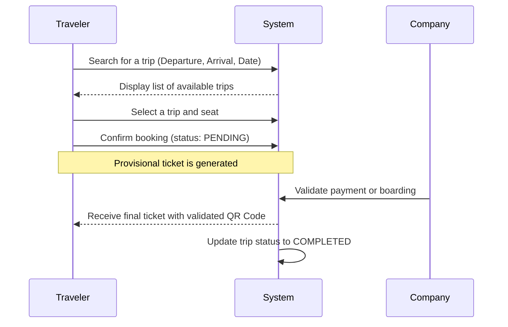
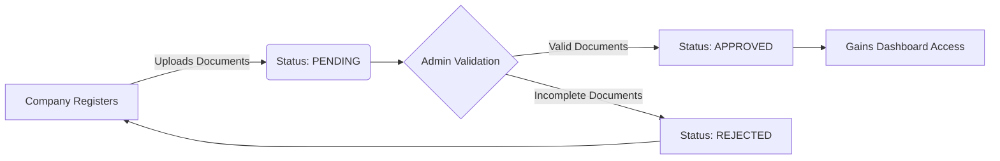

# 🚌 TravelBJ - Bus Booking Platform in Benin

<div align="center">


[](https://github.com/REBCDR07/TravelBJ)
[](https://pnpm.io/)
[](https://reactjs.org/)
[](https://www.typescriptlang.org/)
[](https://tailwindcss.com/)
[](LICENSE)

**The first digital platform revolutionizing intercity transport in Benin.**
Connect, book, travel.

[Features](#-key-features) • [Architecture](#-project-architecture) • [Workflows](#-business-workflows) • [Documentation](#-documentation)

</div>

---

## 📋 Table of Contents

- [🎯 Overview](#-overview)
- [✨ Key Features](#-key-features)
- [🛠 Tech Stack](#-tech-stack)
- [🏗 Project Architecture](#-project-architecture)
- [🔄 Business Workflows](#-business-workflows)
- [🚀 Getting Started](#-getting-started)
- [📚 Documentation](#-documentation)
- [🤝 Contributing](#-contributing)

---

## 🎯 Overview

**TravelBJ** is a comprehensive SaaS solution designed to modernize the transportation sector in Benin. It provides a unified interface for:
1.  **Travelers**: Online ticket booking and real-time trip tracking.
2.  **Companies**: Fleet management, departure scheduling, and reservation monitoring.
3.  **Administration**: Network supervision, stakeholder validation, and global analytics.

### 🎨 Visual Identity
The design system is rooted in the national identity of Benin:
- 🟢 **Green (#008751)**: Hope & Renewal (Primary Actions, Success States)
- 🟡 **Yellow (#FCD116)**: Wealth & Prosperity (Premium Elements, Warnings)
- 🔴 **Red (#E8112D)**: Courage & Strength (Destructive Actions, Error States)

---

## ✨ Key Features

| Module | Features |
| :--- | :--- |
| **👤 Traveler Space** | • Smart search (City, Date, Company)<br>• Visual seat selection<br>• QR Code tickets (PDF/PNG)<br>• Trip history |
| **🏢 Company Space** | • Analytical Dashboard (Booking analytics, Occupancy rate)<br>• Station & Route Management<br>• Boarding validation via QR Scan<br>• Exportable financial reports |
| **🛡️ Admin Space** | • Company KYC (IFU, RCCM verification)<br>• Real-time traffic supervision<br>• User & Role Management<br>• Comprehensive audit logs |

---

## 🛠 Tech Stack

### Frontend
- **Framework**: React 19 (with Hooks)
- **Language**: TypeScript 5.7 (Strict Mode)
- **Build Tool**: Vite 6.1 (HMR, Optimized Builds)
- **Styling**: Tailwind CSS 4 (JIT Engine, Design System)
- **Package Manager**: pnpm

### Core Libraries
| Library | Description |
| :--- | :--- |
| `lucide-react` | Lightweight and beautiful vector icons |
| `recharts` | Data visualization and charting |
| `react-router-dom` | Client-side routing for a Single Page Application (SPA) |
| `jspdf` / `html2canvas` | PDF document generation from HTML |
| `framer-motion` | Fluid animations and gesture support |

---

## 🏗 Project Architecture

The project follows a scalable **Feature-Based** architecture to promote modularity and maintainability.

```mermaid
graph TD
    SRC[src/] --> FEAT[features/]
    SRC --> SHARED[shared/]
    
    FEAT --> AUTH[auth/ (Login, Signup)]
    FEAT --> CLIENT[client/ (Traveler Dashboard)]
    FEAT --> COMPANY[company/ (Company Dashboard)]
    FEAT --> ADMIN[admin/ (Admin Dashboard)]
    FEAT --> PUBLIC[public/ (Landing, Search)]
    
    SHARED --> COMPS[components/ (UI Kit)]
    SHARED --> SERV[services/ (API, Storage)]
    SHARED --> TYPES[types/ (TS Interfaces)]
    SHARED --> UTILS[utils/ (Helpers)]
```

---

## 🔄 Business Workflows

### 1. Traveler Booking Process



### 2. Company Onboarding (KYC)



---

## 🚀 Getting Started

This project uses [pnpm](https://pnpm.io/) as the package manager.

### Prerequisites
- **Node.js**: `v18.x` or higher
- **pnpm**: `v9.x` or higher

### Quick Start

1.  **Clone the repository:**
    ```bash
    git clone https://github.com/REBCDR07/TravelBJ.git
    cd TravelBJ
    ```

2.  **Install dependencies:**
    ```bash
    pnpm install
    ```

3.  **Run the development server:**
    ```bash
    pnpm dev
    ```

> The application will be running at `http://localhost:5173`.

---

## 📚 Documentation

Detailed technical documentation is available in the `/docs` folder:

- [📂 Detailed Architecture](docs/ARCHITECTURE.md): In-depth explanation of the folder structure and technical choices.
- [🚦 Getting Started Guide](docs/GETTING_STARTED_GUIDE.md): Full guide on environment setup and available scripts.
- [📝 Contribution Rules](docs/CONTRIBUTING.md): Guidelines on code conventions, Git flow, and pull requests.

---

## 🤝 Contributing

Contributions are what make the open-source community such an amazing place to learn, inspire, and create. Any contributions you make are **greatly appreciated**.

1.  Fork the Project
2.  Create your Feature Branch (`git checkout -b feature/AmazingFeature`)
3.  Commit your Changes (`git commit -m 'Add some AmazingFeature'`)
4.  Push to the Branch (`git push origin feature/AmazingFeature`)
5.  Open a Pull Request

---

<div align="center">

**TravelBJ** © 2025 - Made with ❤️ in Cameroon

</div>
