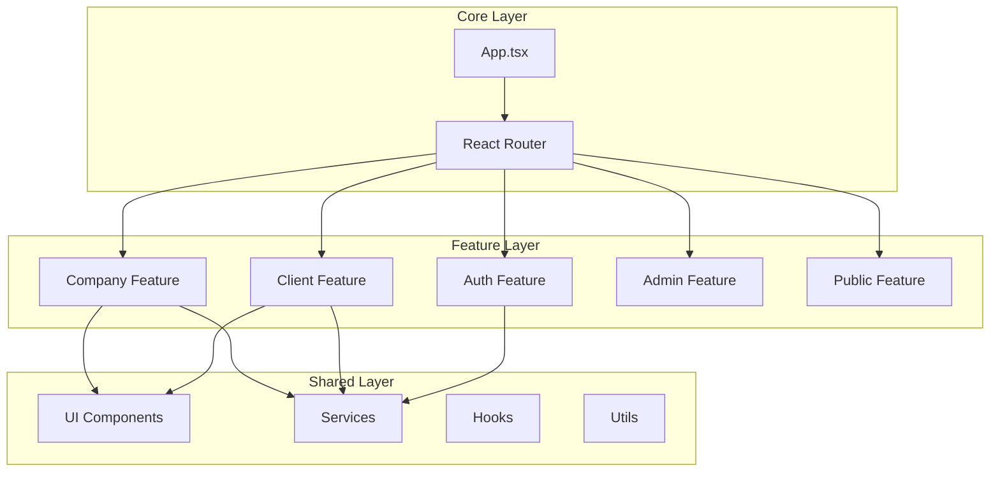
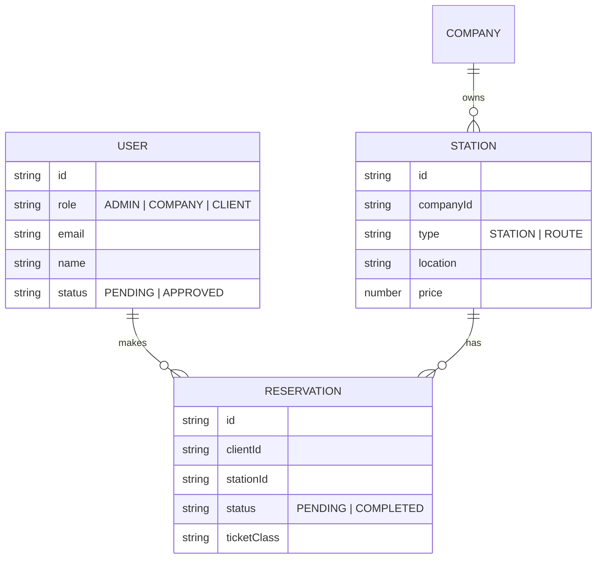

# 🏗 Architecture Technique - VoyageBj

Ce document détaille l'architecture logicielle de la plateforme VoyageBj, ses choix techniques et sa structure modulaire.

## 📐 Vue d'ensemble

L'application suit une architecture **Modulaire par Fonctionnalité (Feature-Based)**. Cela signifie que le code est organisé autour des domaines métier (Client, Compagnie, Admin) plutôt que par type de fichier (Components, Services, Utils).



---

## 📂 Structure des Dossiers

Voici l'arborescence détaillée du dossier `src/` :

```bash
src/
├── features/                 # 📦 Modules Fonctionnels
│   ├── admin/               # Espace Administrateur
│   │   └── AdminDashboard.tsx
│   ├── auth/                # Authentification (Login/Signup)
│   │   ├── LoginVoyageur.tsx
│   │   ├── SignupCompany.tsx
│   │   └── ...
│   ├── client/              # Espace Voyageur
│   │   └── ClientDashboard.tsx
│   ├── company/             # Espace Compagnie
│   │   ├── CompanyDashboard.tsx
│   │   └── StationManager.tsx
│   └── public/              # Pages Publiques
│       ├── LandingPage.tsx
│       ├── SearchResultsPage.tsx
│       └── CompaniesPage.tsx
│
├── shared/                  # 🤝 Code Partagé
│   ├── components/          # Composants UI Réutilisables
│   │   ├── Navbar.tsx
│   │   ├── Ticket.tsx
│   │   ├── SettingsModal.tsx
│   │   └── ...
│   ├── services/            # Logique Métier & API
│   │   └── storage.ts       # Service de persistance (LocalStorage)
│   ├── types/               # Définitions TypeScript
│   │   └── index.ts
│   └── utils/               # Fonctions Utilitaires
│       └── imageUtils.ts
│
├── App.tsx                  # Composant Racine & Routing
├── index.css                # Styles Globaux (Tailwind)
└── main.tsx                 # Point d'entrée
```

---

## 💾 Modèle de Données (Schema)

Bien que l'application utilise `localStorage` pour le moment, les données sont structurées de manière relationnelle.



---

## 🔄 Flux de Données

1.  **Lecture** : Les composants appellent les services (`storage.ts`) pour récupérer les données.
2.  **Écriture** : Les actions utilisateur déclenchent des mises à jour via les services, qui persistent les données dans le `localStorage`.
3.  **Réactivité** : Les changements d'état locaux (`useState`) déclenchent le re-rendu des composants.

> **Note** : Dans une future version avec Backend, les services `storage.ts` seront remplacés par des appels API (`fetch` ou `axios`), sans changer la structure des composants.
