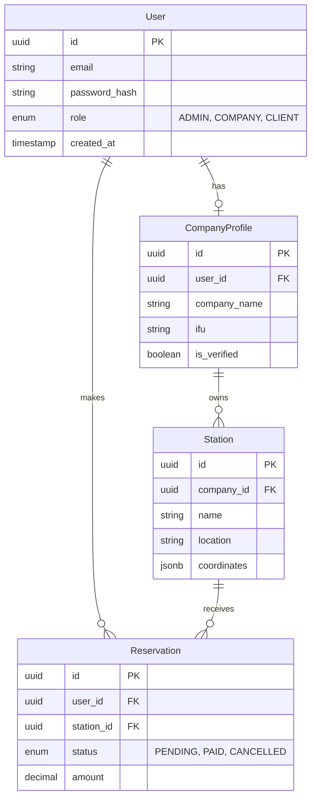

# 🔌 Guide d'Intégration Backend - VoyageBj

Ce document définit la stratégie technique pour migrer l'application **VoyageBj** d'un stockage local (`localStorage`) vers une architecture Backend robuste.

---

## 🎯 Objectif

Passer d'une architecture **Client-Side Only** à une architecture **Client-Server** sécurisée et scalable.

| Actuel (LocalStorage) | Cible (Backend API) |
| :--- | :--- |
| ❌ Données perdues si cache vidé | ✅ Persistance en Base de Données (PostgreSQL) |
| ❌ Pas de temps réel | ✅ Synchronisation temps réel (WebSockets) |
| ❌ Sécurité limitée (Tout est public) | ✅ Authentification sécurisée (JWT + HttpOnly Cookies) |
| ❌ Performance limitée par le navigateur | ✅ Scalabilité et traitements lourds côté serveur |

---

## 🏗 Architecture Cible

Nous recommandons une stack **Node.js + TypeScript** pour partager les types avec le frontend.

```mermaid
graph TD
    subgraph "Frontend (React)"
        UI[Components]
        STORE[State Management]
        API_CLIENT[API Service (Axios)]
    end

    subgraph "Backend (Node.js)"
        API[Express/NestJS API]
        AUTH[Auth Guard (JWT)]
        SRV[Business Logic]
        ORM[Prisma / TypeORM]
    end

    subgraph "Infrastructure"
        DB[(PostgreSQL)]
        REDIS[(Redis - Cache)]
        S3[Object Storage (Images)]
    end

    UI --> STORE
    STORE --> API_CLIENT
    API_CLIENT -- "HTTPS / JSON" --> API
    API --> AUTH
    AUTH --> SRV
    SRV --> ORM
    ORM --> DB
```

---

## 🛤 Plan de Migration

### Phase 1 : Préparation de l'API

1.  **Choix de la Stack** :
    *   **Runtime** : Node.js
    *   **Framework** : NestJS (recommandé pour sa structure) ou Express
    *   **Database** : PostgreSQL
    *   **ORM** : Prisma
2.  **Design de l'API** :
    *   Définir les endpoints RESTful (ex: `GET /api/v1/stations`).
    *   Documenter avec Swagger/OpenAPI.

### Phase 2 : Authentification & Sécurité

1.  Implémenter l'inscription/connexion avec **JWT**.
2.  Remplacer le système actuel de "rôles simulés" par des **Guards** côté serveur.
3.  Sécuriser les mots de passe avec **Argon2** ou **Bcrypt**.

### Phase 3 : Refactoring Frontend (Service Layer)

L'architecture actuelle facilite cette transition grâce au dossier `shared/services`.

**Actuel (`storage.ts`)** :
```typescript
export const getStations = (): Station[] => {
  const data = localStorage.getItem('vb_stations');
  return data ? JSON.parse(data) : [];
};
```

**Cible (`api.ts`)** :
```typescript
import axios from 'axios';

const api = axios.create({ baseURL: '/api/v1' });

export const getStations = async (): Promise<Station[]> => {
  const { data } = await api.get('/stations');
  return data;
};
```

> **Note** : Il faudra adapter les composants pour gérer l'asynchronisme (`async/await`, `useEffect`, `isLoading`).

---

## 💾 Schéma de Base de Données (Proposition)



---

## 📝 Checklist d'Implémentation

- [ ] **Setup Repo Backend** : Initialiser un nouveau projet (Monorepo ou Repo séparé).
- [ ] **Docker** : Créer un `docker-compose.yml` pour la DB PostgreSQL.
- [ ] **Prisma Schema** : Traduire les interfaces TypeScript (`src/shared/types`) en modèles Prisma.
- [ ] **Endpoints CRUD** :
    - [ ] Auth (`/auth/login`, `/auth/register`)
    - [ ] Stations (`/stations`)
    - [ ] Réservations (`/reservations`)
- [ ] **Migration Frontend** :
    - [ ] Créer un hook `useAuth` connecté à l'API.
    - [ ] Remplacer les appels `storage.ts` par React Query (TanStack Query) pour la gestion du cache serveur.

---

## ⚠️ Points d'Attention

1.  **Gestion des Images** : Ne plus stocker en Base64. Uploader vers un service (AWS S3, Cloudinary) et stocker l'URL en DB.
2.  **Gestion des Erreurs** : Standardiser les réponses d'erreur API (400, 401, 403, 500).
3.  **Environnements** : Utiliser des fichiers `.env` pour les secrets (DB URL, JWT Secret).

---

<div align="center">

**Besoin d'aide pour démarrer ?**
Consultez la documentation de [NestJS](https://docs.nestjs.com/) ou [Prisma](https://www.prisma.io/docs/).

</div>
